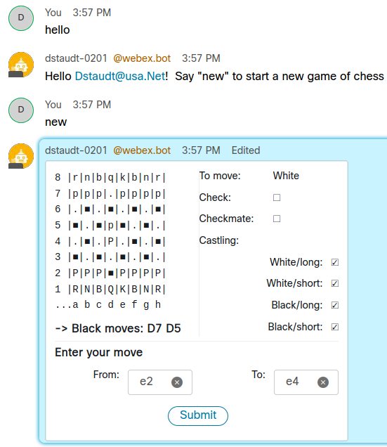

# webex-chess-card-sample

## Overview

Sample application demonstrating the use of interactive, in-place Webex messaging adaptive cards to implement an AI chess program.



https://developer.webex.com/docs/api/guides/cards

**Requirements:**

* Node.js 12.x (LTS)

## Getting started

* Clone this repo:

    ```bash
    git clone https://github.com/CiscoDevNet/webex-chess-card-sample.git
    ```

* Install dependencies:

    ```bash
    cd webex-chess-card-sasmple
    npm install
    ```

* Rename `.env.example` to `.env`, and edit it to specify your Webex bot's access token

* Launch:

    ```bash
    node index.js
    ```

## Hints

* Log output from webex-node-bot-framework can be increased via the `WEBEX_LOG_LEVEL` setting in `.env`

* Currently edits to an adaptive card message are limited to 10.  To-do: include the edit count in a hidden field and generate a new instance when the limit is reached.